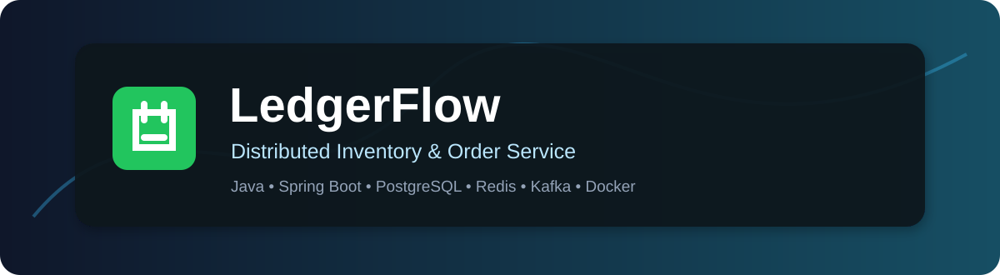
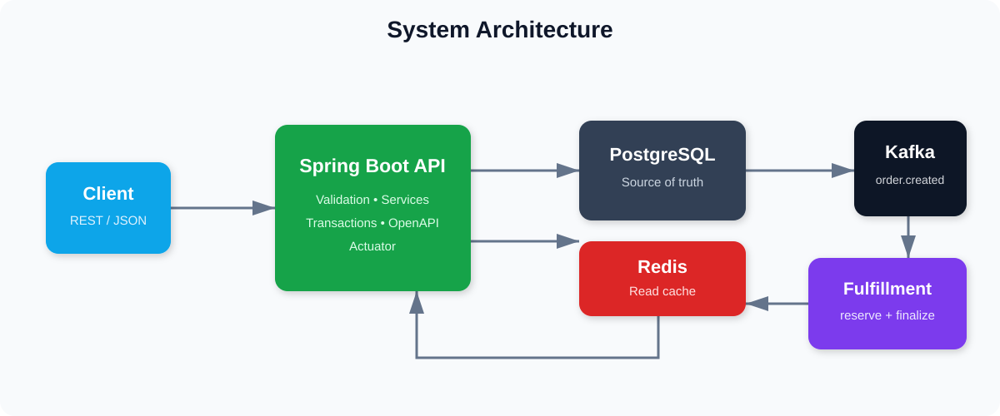
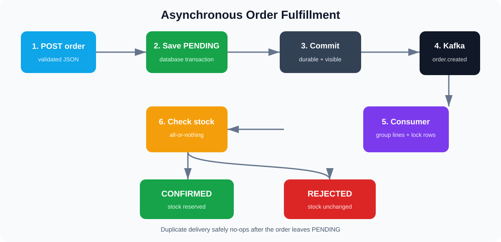
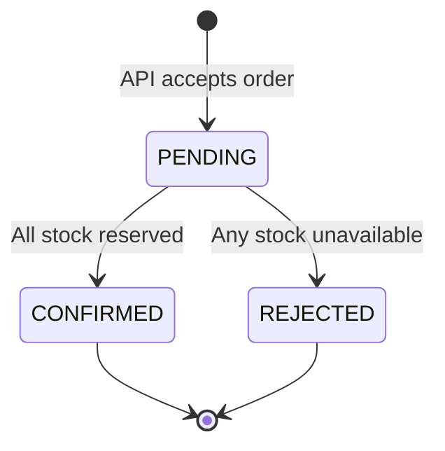
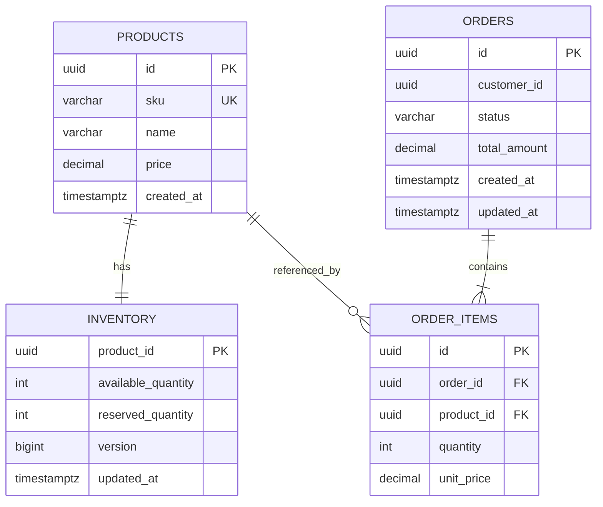
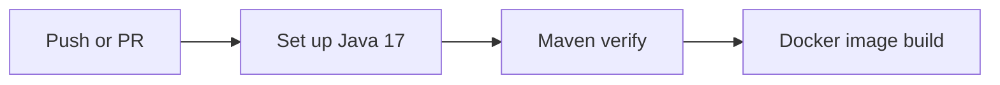

# LedgerFlow — Distributed Inventory & Order Service

<p align="center">
  
</p>

<p align="center">
  
  
  
  
  
  
</p>

**Author:** [Sravani Elavarthi](https://github.com/sravani150602)

**License:** MIT

LedgerFlow is a production-style backend that models distributed order intake and inventory fulfillment. The REST API quickly persists an order as `PENDING`, publishes an event after the database commit, and completes fulfillment asynchronously through Kafka. PostgreSQL locking prevents overselling, Redis accelerates reads, Flyway manages schema changes, and Docker Compose starts the entire platform.

> This project goes beyond basic CRUD. It focuses on consistency, concurrency, idempotency, event processing, indexing, caching, observability, testing, and deployability.

## Contents

- [Key capabilities](#key-capabilities)
- [System architecture](#system-architecture)
- [Complete order workflow](#complete-order-workflow)
- [Data model](#data-model)
- [Consistency and concurrency](#consistency-and-concurrency)
- [Technology stack](#technology-stack)
- [Repository structure](#repository-structure)
- [Run locally](#run-locally)
- [API walkthrough](#api-walkthrough)
- [Configuration](#configuration)
- [Testing and performance](#testing-and-performance)
- [Observability](#observability)
- [Continuous integration](#continuous-integration)
- [Troubleshooting](#troubleshooting)
- [Production roadmap](#production-roadmap)

## Key capabilities

- REST APIs for products, inventory views, order intake, and order status.
- Request DTO validation and consistent HTTP error responses.
- Asynchronous Kafka-based order fulfillment.
- Transactional, pessimistic inventory row locking to prevent overselling.
- Deterministic lock ordering to reduce database deadlock risk.
- Idempotent consumer behavior for Kafka redelivery.
- Redis product/inventory caching with five-minute TTL and mutation eviction.
- PostgreSQL composite and partial indexes designed for specific queries.
- Flyway-controlled, versioned schema migration.
- Swagger/OpenAPI documentation and Spring Boot Actuator endpoints.
- Docker Compose for PostgreSQL, Redis, Kafka, and the application.
- JUnit tests, a 300-VU k6 load scenario, and GitHub Actions CI.

## System architecture

<p align="center">
  
</p>

| Component | Responsibility | Important behavior |
|---|---|---|
| Spring Boot API | Validates input, stores products/orders, exposes REST | Defines database transaction boundaries |
| PostgreSQL | Durable source of truth | Constraints and row locks protect inventory |
| Kafka | Transports `order.created` events | Decouples order acceptance from fulfillment |
| Fulfillment consumer | Reserves stock and finalizes orders | Safely handles repeated delivery |
| Redis | Caches product and inventory responses | Expires after 5 minutes; evicted after fulfillment |
| Flyway | Applies schema migrations | Makes database setup repeatable |
| Actuator/OpenAPI | Health, metrics, and API discovery | Improves operational visibility |

## Complete order workflow

<p align="center">
  
</p>

1. The client sends `POST /api/v1/orders` with a customer ID and product lines.
2. Bean Validation rejects missing IDs, empty item arrays, and non-positive quantities.
3. The service loads every product and snapshots its current price in `order_items`.
4. A `PENDING` order and its items are inserted in one PostgreSQL transaction.
5. The transaction commits and the API returns HTTP `202 Accepted`.
6. An `AFTER_COMMIT` listener publishes `order.created` to Kafka. The consumer can never see an event for an uncommitted order.
7. The consumer combines repeated product lines, then locks required inventory rows in sorted UUID order.
8. When every requested quantity is available, stock moves from available to reserved and the order becomes `CONFIRMED`.
9. If any line is short, no inventory is changed and the order becomes `REJECTED`.
10. A repeated Kafka event no-ops because only a `PENDING` order may transition.

### Order state machine



## Data model



| Table | Purpose |
|---|---|
| `products` | Catalog identity and current price; SKU is unique |
| `inventory` | One stock record per product with available and reserved quantities |
| `orders` | Aggregate root containing customer, state, total, and timestamps |
| `order_items` | Product, quantity, and immutable price snapshot for an order |

Database checks require positive prices and order quantities and nonnegative inventory. Foreign keys protect all relationships even if application validation is bypassed.

## Consistency and concurrency

### Preventing overselling

Fulfillment executes inside one database transaction. `InventoryRepository` takes a pessimistic write lock on every requested product row. Competing orders for the same product serialize:

```text
Starting stock: 5
Order A requests 4 → locks row → reserves 4 → stock becomes 1 → commits
Order B requests 3 → waits      → reads 1     → insufficient   → rejects
```

### Reducing deadlocks

Multi-product orders lock rows in deterministic product-UUID order. Two transactions therefore avoid acquiring the same resources in opposite sequences.

### Handling repeated delivery

Kafka uses at-least-once delivery. Before changing inventory, the consumer checks the order state in the transaction. `CONFIRMED` and `REJECTED` orders are not processed again, preventing double reservation for one order.

### PostgreSQL-to-Kafka boundary

Publishing after commit removes the publish-before-commit race. PostgreSQL and Kafka still do not share one atomic transaction: a Kafka outage at exactly the wrong moment could leave a committed order without an event. A production version requiring guaranteed delivery should add a transactional outbox and CDC/outbox relay.

## Technology stack

| Layer | Technology |
|---|---|
| Runtime | Java 17 |
| API | Spring Boot 3.5, Spring MVC, Bean Validation |
| Persistence | Spring Data JPA, Hibernate, PostgreSQL 16 |
| Messaging | Apache Kafka 3.9 in KRaft mode |
| Cache | Redis 7.4 |
| Schema | Flyway |
| Documentation | Springdoc OpenAPI and Swagger UI |
| Operations | Spring Boot Actuator |
| Testing | JUnit 5, AssertJ, Kafka Test, Testcontainers dependencies |
| Performance | Grafana k6 |
| Packaging | Maven Wrapper, multi-stage Docker build, Docker Compose |
| Automation | GitHub Actions |

## Repository structure

```text
ledgerflow/
├── .github/workflows/ci.yml       # Build, test, and image workflow
├── docs/images/                   # README diagrams
├── load/order-flow.js             # 300-user k6 scenario
├── src/main/java/com/ledgerflow/
│   ├── api/                       # Controllers, DTOs, error responses
│   ├── config/                    # Kafka topic configuration
│   ├── domain/                    # Entities and order state
│   ├── event/                     # Event contract and publisher
│   ├── repository/                # Persistence queries and row locking
│   └── service/                   # Business and fulfillment logic
├── src/main/resources/
│   ├── db/migration/V1__init.sql  # Tables, constraints, and indexes
│   └── application.yml            # Environment-based configuration
├── src/test/                      # Automated tests
├── compose.yaml                   # Full local platform
├── Dockerfile                     # Multi-stage application image
├── Makefile                       # Developer shortcuts
└── pom.xml                        # Maven project
```

## Run locally

### Prerequisites

- Docker Desktop or Docker Engine with Compose v2
- At least 4 GB of memory available to Docker
- `curl` for the examples

Java and Maven are not required when using Docker.

### 1. Clone and start everything

```bash
git clone https://github.com/sravani150602/ledgerflow.git
cd ledgerflow
docker compose up --build
```

Services:

| Service | Port |
|---|---:|
| LedgerFlow API | `8080` |
| PostgreSQL | `5432` |
| Redis | `6379` |
| Kafka | `9092` |

### 2. Verify the application

```bash
curl http://localhost:8080/actuator/health
```

Expected:

```json
{"status":"UP"}
```

### 3. Open documentation

- Swagger UI: <http://localhost:8080/swagger-ui.html>
- OpenAPI JSON: <http://localhost:8080/v3/api-docs>
- Health: <http://localhost:8080/actuator/health>
- Metrics list: <http://localhost:8080/actuator/metrics>

### 4. Stop

```bash
docker compose down
```

Use `docker compose down -v` only when you also want to delete local PostgreSQL data.

## API walkthrough

### Create a product

```bash
curl -i -X POST http://localhost:8080/api/v1/products \
  -H 'Content-Type: application/json' \
  -d '{
    "sku":"LAPTOP-001",
    "name":"Developer Laptop",
    "price":1299.00,
    "initialQuantity":500
  }'
```

`201 Created`:

```json
{
  "id": "9f19d952-5107-4691-ab16-c635c517522f",
  "sku": "LAPTOP-001",
  "name": "Developer Laptop",
  "price": 1299.00,
  "availableQuantity": 500,
  "reservedQuantity": 0
}
```

### Read a product

```bash
curl http://localhost:8080/api/v1/products/9f19d952-5107-4691-ab16-c635c517522f
```

The initial read populates Redis. Repeated reads use the cached response until its TTL expires or fulfillment evicts it.

### Submit an order

```bash
curl -i -X POST http://localhost:8080/api/v1/orders \
  -H 'Content-Type: application/json' \
  -d '{
    "customerId":"00000000-0000-0000-0000-000000000001",
    "items":[{
      "productId":"9f19d952-5107-4691-ab16-c635c517522f",
      "quantity":2
    }]
  }'
```

`202 Accepted` returns a `PENDING` order because fulfillment occurs asynchronously.

### Read final order status

```bash
curl http://localhost:8080/api/v1/orders/ORDER_UUID
```

Poll briefly until the response becomes `CONFIRMED` or `REJECTED`.

### Error response

```json
{
  "timestamp": "2026-08-29T15:30:00Z",
  "status": 400,
  "error": "Bad Request",
  "message": "Validation failed",
  "path": "/api/v1/orders"
}
```

## Configuration

| Variable | Default | Description |
|---|---|---|
| `PORT` | `8080` | Application HTTP port |
| `DB_URL` | `jdbc:postgresql://localhost:5432/ledgerflow` | JDBC connection URL |
| `DB_USER` | `ledgerflow` | PostgreSQL username |
| `DB_PASSWORD` | `ledgerflow` | PostgreSQL password |
| `REDIS_HOST` | `localhost` | Redis hostname |
| `KAFKA_BOOTSTRAP_SERVERS` | `localhost:9092` | Kafka broker addresses |

Compose overrides hostnames using its internal network. Production secrets should come from a secret manager and never be committed.

## Testing and performance

### Test and package

```bash
./mvnw verify
```

The included domain tests verify valid stock reservation and overselling rejection. Kafka and Testcontainers test dependencies are also configured for extending infrastructure-level integration coverage.

### Load test with 300 concurrent users

Create a well-stocked product, then run:

```bash
make load PRODUCT_ID=YOUR_PRODUCT_UUID
```

`load/order-flow.js` executes 300 virtual users for 30 seconds and asserts:

- order requests return HTTP `202`;
- request failure rate is below 1%;
- p95 HTTP request duration is below 150 ms.

Performance depends on the machine, Docker allocation, dataset, and database state. Record the exact test environment and actual k6 summary before quoting a measured result.

### Index strategy

| Index | Query pattern |
|---|---|
| `idx_orders_customer_created` | Recent orders for one customer |
| `idx_orders_status_created` | Operational orders by status and age |
| `idx_order_items_order_product` | Items for an order and product |
| `idx_inventory_available` | Partial scan of currently available stock |

Validate a query plan with:

```sql
EXPLAIN (ANALYZE, BUFFERS)
SELECT *
FROM orders
WHERE customer_id = '00000000-0000-0000-0000-000000000001'
ORDER BY created_at DESC
LIMIT 20;
```

## Observability

```bash
curl http://localhost:8080/actuator/health
curl http://localhost:8080/actuator/metrics/http.server.requests
curl http://localhost:8080/actuator/metrics/jvm.memory.used
docker compose logs -f app
docker compose logs -f kafka
```

Health probes allow the container runtime to detect an unhealthy application. Actuator metrics expose JVM and HTTP behavior for development diagnostics.

## Continuous integration



Every push and pull request triggers `.github/workflows/ci.yml`:

1. Check out the repository.
2. Install Temurin Java 17 and restore the Maven dependency cache.
3. Run `./mvnw verify`.
4. Build the production Docker image tagged with the commit SHA.

Any failed test or Docker build fails the workflow.

## Troubleshooting

### A port is already in use

Check ports `5432`, `6379`, `9092`, and `8080`. Stop the conflicting local service or change the port mapping in `compose.yaml`.

### Order remains PENDING

Confirm the Kafka container is healthy, review application logs, and check that the topic exists:

```bash
docker compose exec kafka /opt/kafka/bin/kafka-topics.sh \
  --bootstrap-server kafka:29092 --list
```

### Application cannot connect to PostgreSQL

Run `docker compose ps`, verify the database health check passes, and inspect `docker compose logs postgres`. Inside Compose, the host must be `postgres`, not `localhost`.

### Completely reset local data

```bash
docker compose down -v
docker compose up --build
```

This permanently removes the local development database volume.

## Production roadmap

- Transactional outbox with Debezium/CDC for guaranteed event publication.
- Dead-letter topic, bounded retries, and controlled replay tooling.
- Idempotency keys for repeated client order submissions.
- OAuth2/JWT authentication, role-based authorization, and rate limiting.
- OpenTelemetry tracing and Prometheus/Grafana dashboards.
- Full Testcontainers integration suite for PostgreSQL, Redis, and Kafka.
- Reservation expiration and compensation for canceled orders.
- Managed multi-zone infrastructure with backups and alerts.
- Kubernetes manifests or Helm deployment chart.

## License

Licensed under the [MIT License](LICENSE).

---

Built by **[Sravani Elavarthi](https://github.com/sravani150602)**.
